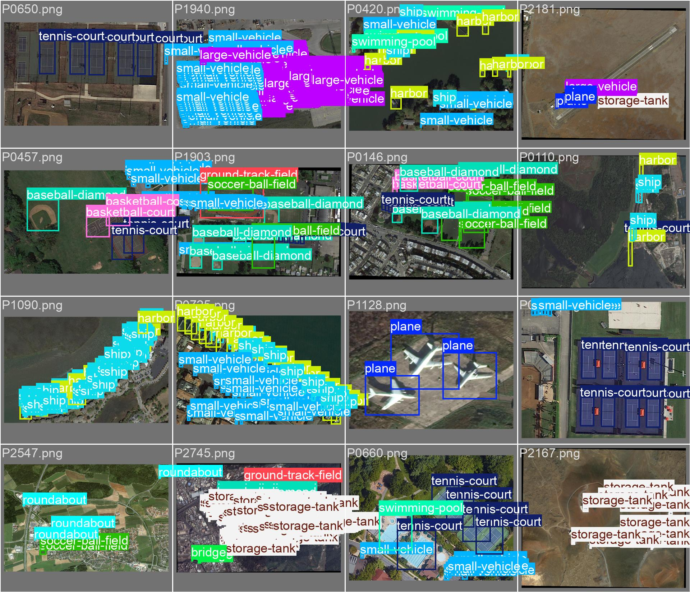

# Object Detection
This project demonstrates solving the **object detection problem** for **aerial images** using two very popular deep learning models: the **anchor-free YOLO method** and the **anchor-based Faster R-CNN**. The dataset used is DOTA v1.0, a large-scale aerial imagery dataset that includes 15 object classes such as plane, ship, storage tank, baseball diamond, tennis court, basketball court, ground track field, harbor, bridge, large vehicle, small vehicle, helicopter, roundabout, soccer ball field, and swimming pool.



---

## Project Structure
```
object-detection-dota/
│── object_detection_YOLO.ipynb        # YOLOv8 training & evaluation
│── object_detection_Faster-RCNN.ipynb # Faster R-CNN training & evaluation
│
│── src/
│   └── preprocessing.py               # Converts DOTA polygons → YOLO/COCO formats
│
│── Datasets/
│   └── DOTA/                          # raw dataset (downloaded from DOTA)
│       ├── train/                     # raw train images
│       ├── val/                       # raw val images
│
│── README.md

```

## Setup Instructions

This project was primarily run on Google Colab, so package installation was handled within the notebooks.

If you wish to run locally, ensure you have:

- Python 3.10+
- PyTorch & Torchvision (with CUDA if available)
- YOLO framework (ultralytics for YOLOv8)
- pycocotools for COCO annotations
- matplotlib, Pillow for visualization


## Preprocessing Step

All preprocessing is handled in `src/preprocessing.py`:

- **Load data:** read raw images + polygon labels.  
- **Split sets:**  
  - Official train set → 80% train, 20% validation  
  - Official val set → used as test  
- **Convert labels:**  
  - YOLO branch → `.txt` annotations (normalized)  
  - Faster R-CNN branch → COCO `.json` annotations  
- **Organize folders:** images/labels saved into `train/`, `val/`, `test/`  

### Configuration
Update the dataset paths in `src/preprocessing.py` before running the notebooks:
```python
DATASET_ROOT = "/content/drive/MyDrive/Datasets/DOTA"
OUTPUT_DIR   = "/content/drive/MyDrive/Datasets/DOTA_coco"
```


## Run the Notebooks

- YOLO Pipeline:
run the notebook `object_detection_YOLO.ipynb`

- Faster R-CNN Pipeline:
run the notebook `object_detection_Faster-RCNN.ipynb`

